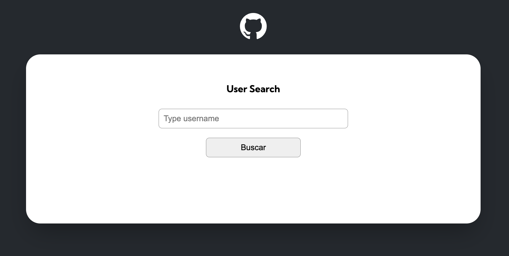

# Github User Search 

Project using Github API 

## Table of contents

- [Overview](#overview)
- [Screenshot](#screenshot)
- [Built with](#built-with)
- [Author](#author)

## Overview

Users should be able to:

- Search Github user by username
- After the search, the user will see some  profile information:
    - Image
    - Name
    - Bio
    - Followers and Following number.
    
    -Repositories:

    - A maximum of 10 repositories, with the number of forks, stars, watchers and language and each of the repositories is a link to the repository.

    -Event List

    - List of the last 10 events:
    
    Only events created within the past 90 days will be included in timelines

        - PushEvent:
        repository name - event message
        - CreateEvent:
        repository name - CreateEvent
    
    * Only events created within the past 90 days will be included in timelines. Events older than 90 days will not be included (even if the total number of events in the timeline is less than 300).

### Screenshot

#### Search

#### Repositories

#### Responsive

### Built with

- HTML5
- CSS
- Javascript

## Author
- Linkedin - [@ottosuhett](https://www.linkedin.com/in/ottopereira/)
